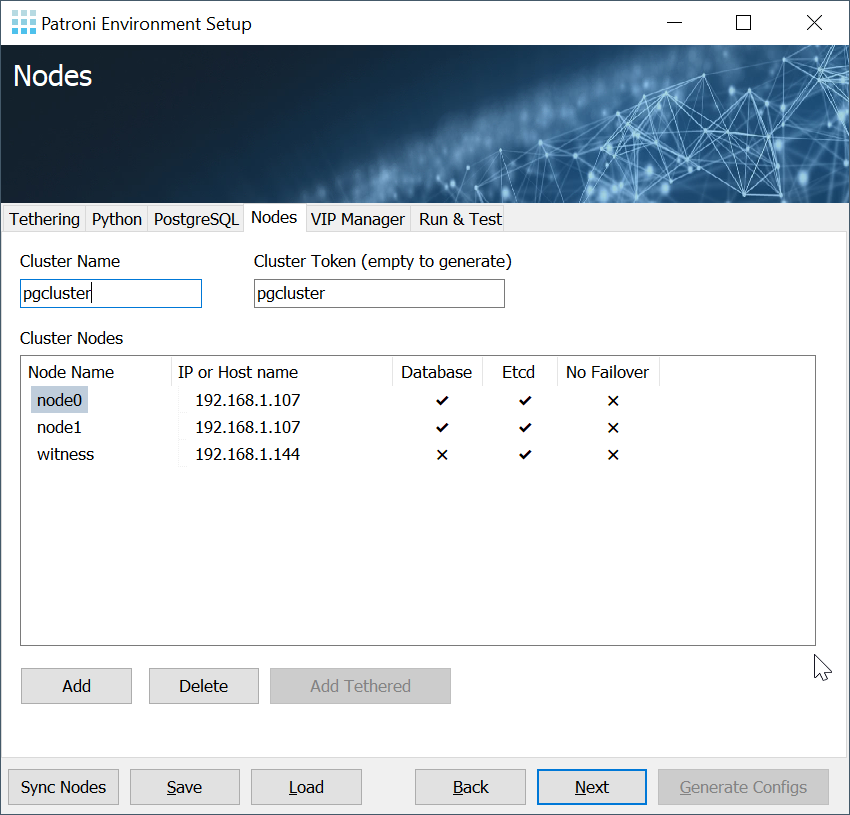
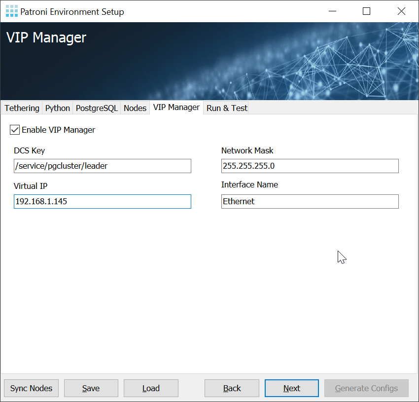

<p align="center">

</p>

# PES: Patroni Environment Setup


Application can be used in two modes:
* interactive
* standalone configuration editor

In interactive mode PES instances, launched on different nodes, can syncrhonize cluster settings with **Sync configs** button and generate configurations locally. To enable interactive mode press **Connect** button:


If the machine were PES launched supposed to be one of the nodes, you can check Python dependancies:


PostgreSQL specific settings can be set on the corresponding tab. Right now all settings are the same for all nodes participating.


Nodes tab represent all nodes in the future cluster. Not every node must run database, this is the common setup where only two database and one witness node with etcd.


VIP Manager (if enabled) should run on every database node. Right now all settings are the same for all nodes participating.


**Save** button will save cluster information in the internal format to open and edit it later.

**Load** button will open previously saved cluster in internal format for further edit.

**Finish** button will produce all needed configurations file for every node participated. The hierarchy will contain folders with node names containing `.yml` configuration files, e.g.

```
db1
  - patroni.yml
  - patronictl.yml
  - etcd.yml
db2
  - patroni.yml
  - patronictl.yml
  - etcd.yml
witness
  - patroni.yml
  - patronictl.yml
  - etcd.yml
```
